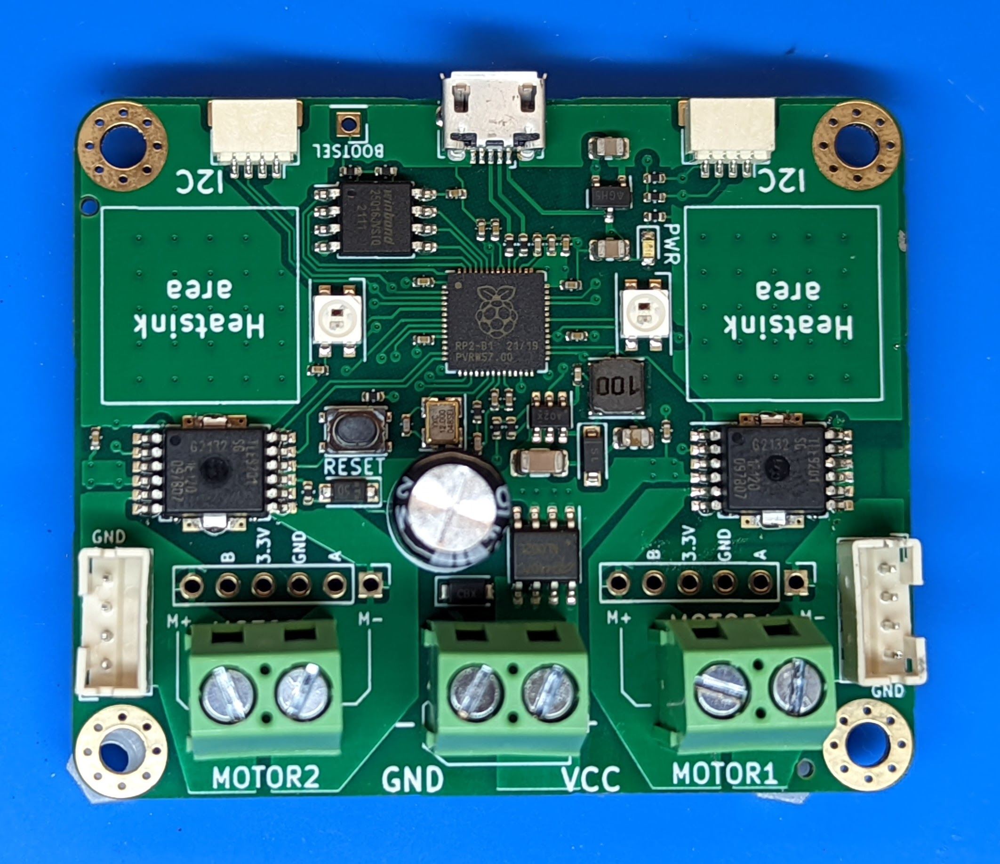

##################################
Personal Robotics Motor Controller
##################################

This guide contains documentation for a dual channel controller for DC motors.
This controller was created by group of robotics enthusiasts from Personal Robotics
discord server, who needed a mid-power dual channel motor controller supporting
closed loop motor control but were not ready to pay $70 and more for existing
commercial realizations.

Key features of this controller are as follows:

* support for 2 brushed DC motors

* Motor voltage: 5-18v; reverse polarity protection for power input

* Current per channel

  - 8A peak, current limited

  - 3.5A continuous if used without heatsinks

  - 5A continuous with optional heatsinks

* Support for quadrature encoders (3.3v) for each channel

* Closed loop speed control, using PID algorithm

* Variety of protection features: automatic overcurrent, overtemperature,
  undervoltage, and short circuit protection

* Controlled by a host microcontroller  or single board computer such as Raspberry Pi
  using I2C interface. MicroPython library is available

All design files and software are available from the project |github| under open
source license.

This document describes version 2.0 of the project, released in April 2022.

.. toctree::
    :caption: Table of Contents
    :maxdepth: 1

    specs
    firmware
    mp_library
