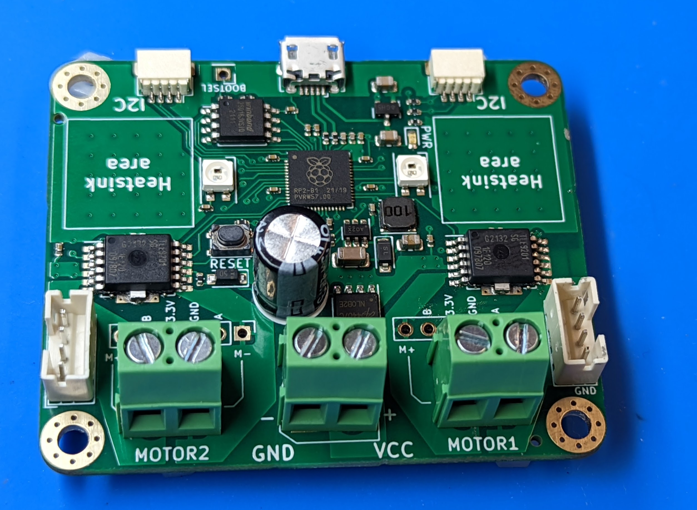
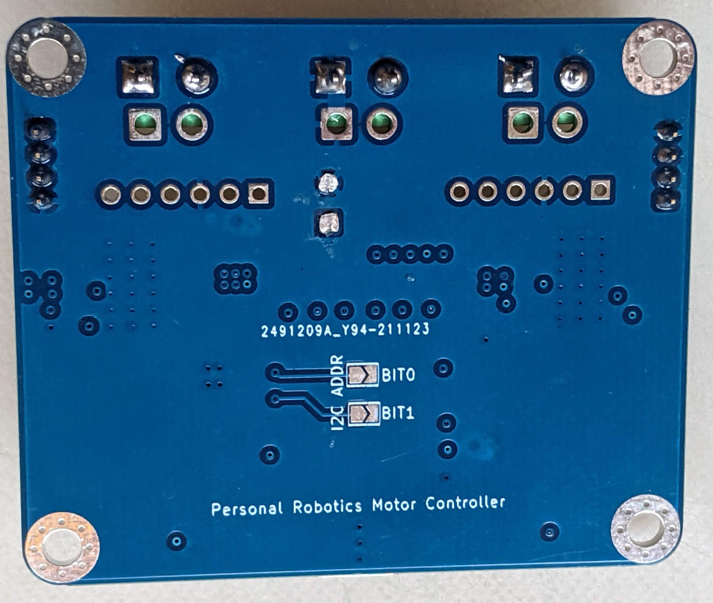
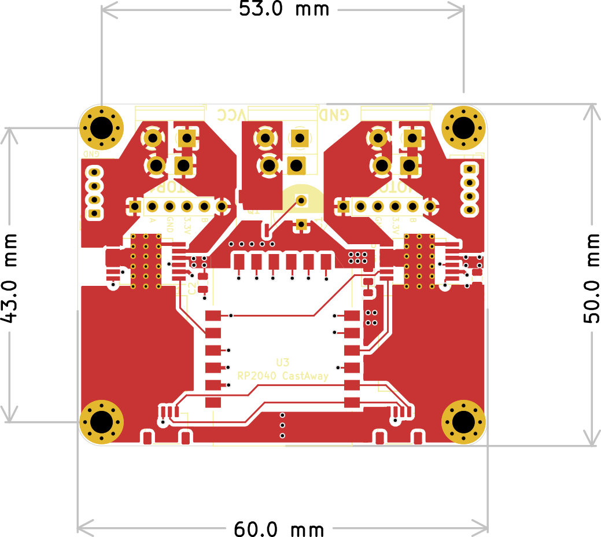

.. _specs:
**************************
Specifications
**************************

Overview
=========
The Personal Robotics  Motor Controller (which from now on will be abbreviated to PRMC)
can be used to control two brushed DC motors (5-18V) with quadrature encoders.
It provides position and speed reading (if encoders are present) and closed-loop
mode in which it keeps motor speed constant using encoder feedback and PID algorithm.

I2C interface
=============
PRMC is controlled by a host MCU (Arduino or similar boards) or
single board computer such as Raspberry Pi using I2C interface.
It uses 3.3v I2C bus, at up to 400 kHz speed. There are two identical
Qwiic/Stemma QT connectors allowing one to daisy-chain several controllers.

PRMC includes 10k pullups to 3.3v  on SCL and SDA lines; you might want to add
additional pullups on the i2c master.

**Important**: the 3.3v pin of the Qwiic connectors is unconnected. Instead,
PRMC uses its own voltage regulator to provide power to the built-in electronics.
This also means that when daisy-chaining, it will not provide power to other I2C devices.

By default, the controller uses I2C address `0x54` (or 84 in decimal form).
It can be changed by closing solder bridge jumpers on the bottom side  of the
board, below label `I2C ADDRESS`:

* closing jumper labeled `0` sets bit 0, adding  1 to the address

* closing jumper labeled `1` adds 2 to the address

* closing jumper labeled `2` adds 4 to the address

Thus, by using different combinations of the jumpers, one can get any address between
`0x54` (decimal 84) and `0x5A` (decimal 91), allowing one to use up to 8 such
motor controllers on the same bus.

Power supply
============
PRMC is intended for use with  motor power supply of **5--18V**. Absolute maximum
voltage for power supply is 24V; voltages above that will damage PRMC. Please
note that actual voltage provided by the battery can be higher than nominal voltage:
e.g., a 10-cell NiMH battery pack has nominal voltage of 12V but in fact a fully
charged pack can read as high as 14V.

The power supply connection has
reverse polarity protection preventing damage if the power leads are switched.
It also has limited  ESD protection to protect  it from spikes caused by electrostatic discharge.

PRMC contains a voltage regulator (a combination of buck converter and an LDO) providing
3.3v power to on-board electronics from the motor power supply.

Electronics
===========
Key components of PRMC are two `TLE9201SG <https://www.infineon.com/cms/en/product/power/motor-control-ics/brushed-dc-motor-driver-ics/integrated-full-bridge-driver/tle9201sg/>`__ motor controller
ICs by Infineon; please read the IC  datasheet for details of their operation.

PRMC also contains an RP2040 MCU by Raspberry Pi. It is preloaded with firmware
providing I2C interface, reading quadrature encoders, and providing closed loop motor control.

Indicator LEDs
==============
PRMC includes a green power indicator LED; it lights up whenever the board is powered.
In addition, it has two NeoPixel LEDs used to show the status of motors as follows:

 - Blue: firmware running, but no I2C connection yet

 - Green: motor enabled

 - Red: motor disabled (either by command from  host MCU or because of triggered
   protection such as overtemperature protection).

Connections
===========
The board provides several options for connecting motors, encoders, and main power:

* Motor connections: you can choose between

  - 5mm pitch screw terminal (we use high-quality rising cage type terminals)

  - JST VH connector (same as used by First Tech Challenge robotics competitions) 

  - 6pin Dupont connectors (matching pinout of `22mm motors <https://www.servocity.com/142-rpm-premium-planetary-gear-motor-w-encoder/>`__
    sold by Servocity). Note: 6pin Dupont connectors used on other motors - e.g.
    `25mm motors <https://www.pololu.com/product/4865>`__ from Pololu - may use different pin order.

* Encoder connections: a 4-pin JST PH connector, using the following pin order:

  - Pin 1: GND;

  - Pin 2: 3.3V;

  - Pin 3: Channel A;

  - Pin 4: Channel B.

  (This matches the pin order of
  `REV control hub <https://www.revrobotics.com/rev-31-1595/>`__ used in First Tech Challenge robotics competitions.)

* Main power: 5mm pitch screw terminal or XT30 male connector

* I2C connectors: the board provides two I2C Qwiic/Stemma QT I2C connectors.
  This makes it possible to daisy-chain connectors. (Note: I2C connector doesn't
  provide 3.3v power, see above.)

The photos below show PRMC with different combinations of connectors.

* With 5mm pitch screw terminals for main power and motors:

  .. figure:: images/front_view_term.jpg
     :alt: Top view
     :width: 80%

* With 5mm pitch screw terminals for main power and male headers for motor
  connectors

  .. figure:: images/front_view_dupont.jpg
     :alt: Top view
     :width: 80%

* With XT30 male connector  for main power and VH2 connectors for motors:

   .. figure:: images/front_view_xt30.jpg
      :alt: Top view
      :width: 80%

Current limit
=============
Motor driver ICs provide current limiting: if the output current exceeds 8A,
the drivers will start "chopping" the current, preventing it from ever exceeding 8A.
This makes it possible  to use the controller with motors with stall current over 8A.

However, 8A can only be sustained for short period of time; at this current,
the board will overheat quickly. Our testing shows that the board can continuously
provide 3.5A per channel in default configuration.

The board also contains two areas to which one can attach optional 14mm square heatsinks
(which are commonly used for Raspberry Pi single board computers and thus are
easily available from many vendors). With the heatsinks attached, the board can
provide up to 5A  continuous per channel.

Protection features
===================
In addition to current limiting listed above, the motor drivers also provide
variety of other protection features:

* undervoltage

* overtemperature

* short circuit

Please see the TLE9201 `datasheet <https://www.infineon.com/dgdl/Infineon-TLE9201SG-DS-v01_00-en.pdf?fileId=db3a304345087709014518190f481cec>`__ for details.

If any of the protection features are triggered, the IC automatically disables
motor output. Firmware allows the user to check the motor status to see if
the output has been disabled and if desired, re-enable it.

Dimensions
===========
The board dimensions are 50x60mm. Board height depends on the chosen connectors;
with screw terminals, height is about 14mm. If you use JST VH for motors or XT30
connector for power, you will need at least 22mm clearance above the PCB for the
connector and cables.

There are four mounting holes for M3 or smaller screws; their position is
shown in the diagram below.

