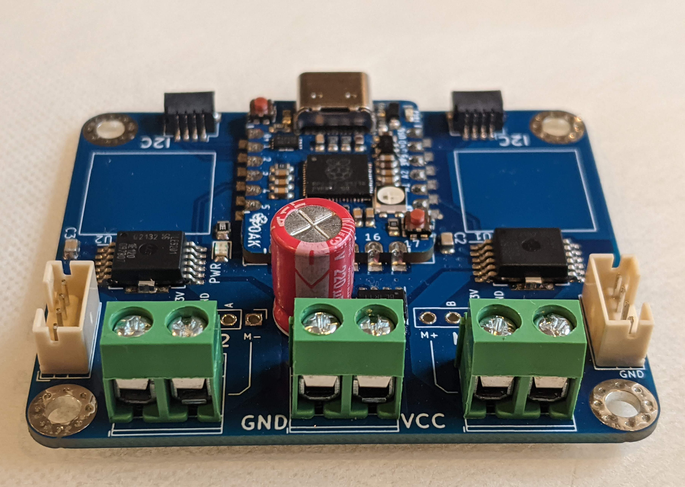

.. _specs:
**************************
Specifications
**************************

General
=======
The controller can be used to control two brushed DC motors (5-18V) with quadrature encoders.
It provides position and speed reading (if encoders are present) and closed-loop
mode in which it keeps motor speed constant using encoder feedback and PID algorithm.

The motor controller is controlled by a host MCU (Arduino or similar boards) or
single board computer such as Raspberry Pi using I2C interface (3.3V, up to
400kHz speed).

I2C address
===========
By default, the controller uses I2C address `0x54`.
It can be changed by closing solder bridge jumpers on the bottom side  of the board:

* closing jumper labeled `Bit0` adds 1 to the address

* closing jumper labeled `Bit1` adds 2 to the address

Thus, by using different combinations of the jumpers, one can get any address between
`0x54` and `0x57`, allowing one to use up to 4 such motor controllers on the same bus.

.. figure:: images/bottom_view.jpg
    :alt: Bottom view
    :width: 80%

Power supply
============
The controller accepts motor power supply of **5--18V**. The power supply connection has
reverse polarity protection preventing damage if the power leads are switched.
The board also contains a power indicator LED.

The on-board electronics  is powered by 3.3V from Qwiic/Stemma QT I2C connectors.
Thus, the board can not operate without connecting the I2C bus.

Electronics
===========
Key components of the controller are two `TLE9201SG <https://www.infineon.com/cms/en/product/power/motor-control-ics/brushed-dc-motor-driver-ics/integrated-full-bridge-driver/tle9201sg/>`__ motor controller
ICs by Infineon; please read the IC  datasheet for details of their operation.

The board also contains an MCU,  `Castaway RP2040 <https://www.tindie.com/products/oakdevtech/cast-away-rp2040-a-castellated-rp2040-dev-board/>`__ board featuring
Raspberri Pi RP2040 chip. This MCU is preloaded with firmware controlling the
motor driver ICs.

Connections
===========
The board provides several options for connecting motors, encoders, and main power:

* Motor connections: you can choose between 5mm pitch screw terminal,
  JST VH connector, or 6pin Dupont connectors (matching pinout of `22mm motors <https://www.servocity.com/142-rpm-premium-planetary-gear-motor-w-encoder/>`__
  sold by Servocity). Note: 6pin Dupont connectors used on other motors - e.g.
  `25mm motors <https://www.pololu.com/product/4865>`__ from Pololu - may use different pin order.

* Encoder connections: a 4-pin JST PH connector, using the following pin order:
  Pin1: GND; Pin 2: 3.3V; Pin 3: Channel A; Pin 4: Channel B. (This matches the pin order of
  `REV control hub <https://www.revrobotics.com/rev-31-1595/>`__ used in First Tech Challenge robotics competitions.)

* Main power: 5mm pitch screw terminals.

* I2C connectors: the board provides two I2C Qwiic/Stemma QT I2C connectors.
  This makes it possible to daisy-chain connectors.

Current limit
=============
Motor driver ICs provide current limiting: if the output current exceeds 8A,
the drivers will start "chopping" the current, preventing it from ever exceeding 8A.
This makes it possible  to use the controller with motors with stall current over 8A.

However, 8A can only be sustained for short period of time; at this current,
the board will overheat quickly. Our testing shows that the board can continuously
provide 3.5A per channel in default configuration.

The board also contains two areas to which one can attach optional 14mm square heatsinks
(which are commonly used for Raspberry Pi single board computers and thus are
easily available from many vendors). With the heatsinks attached, the board can
provide up to 5A  continuous per channel.

Protection features
===================
In addition to current limiting listed above, the motor drivers also provide
variety of other protection features:

 * undervoltage

* overtemperature

* short circuit

Please see the TLE9201 `datasheet <https://www.infineon.com/dgdl/Infineon-TLE9201SG-DS-v01_00-en.pdf?fileId=db3a304345087709014518190f481cec>`__ for details.

If any of the protection features are triggered, the IC automatically disables
motor output. Firmware allows the user to check the motor status to see if
the output has been disabled and if desired, re-enable it.

Dimensions
===========
The board dimensions are 50x60mm; height is about 12mm (not including connected cables).

There are four mounting holes for M3 or smaller screws; their position is
shown in the diagram below.

.. figure:: images/dimensions.png
    :alt: Board dimensions
    :width: 80%
